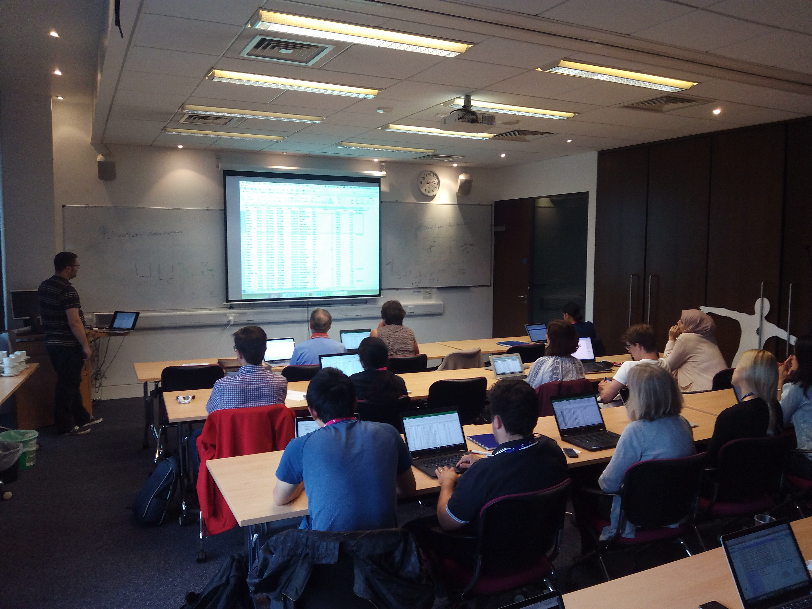

# Avoiding Data Disasters

- Date: 12th July 2017, 1:30 - 4:30pm
- Location: Room 2015, Cancer Research UK - Cambridge Institute ([CRUK-CI](http://www.cruk.cam.ac.uk/)), University of Cambridge, UK

## Overview

The course was delivered in collaboration with [Mark Dunning](https://github.com/markdunning) and [Anne Pajon](https://github.com/pajanne). I covered the data and [file management part](20170712_FileManagement.pdf) of the discussion.

See all course [contents and materials](https://datachampcam.github.io/avoid-data-disaster/) and [feedback](20170712_feedback.csv).

## TODO

- [Zenodo](https://zenodo.org/) to get DOI for materials hosted in GitHub
- [Google forms](https://www.google.co.uk/forms/about/) to get feedback from participants

